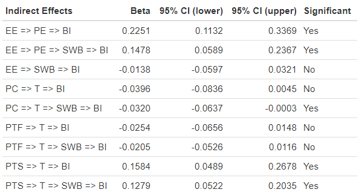

# semUtils
Tools for Structural Equation Modeling

## Installing

``` r
# the devtools package needs to be installed for this to work
devtools::install_github("juliencloarec/semUtils") 
```

## Demonstration

With the `mediation()` function from the **semUtils** package, you can easily analyze the indirect effects of a [**lavaan**](https://lavaan.ugent.be/) syntax.

```{r}
library(semUtils)

database <- read.csv("SmartHomes.csv")

model <- '
  EE =~ EE1 + EE2 + EE3
  PE =~ PE1 + PE2 + PE3 + PE4
  PTS =~ PTS1 + PTS2 + PTS3
  PTF =~ PTF1 + PTF2 + PTF3
  PC =~ PC1 + PC2 + PC3 + PC4 + PC5 + PC6 + PC7 + PC8 + PC9
  T =~ T1 + T2 + T3 + T4
  SWB =~ SWB1 + SWB2 + SWB3
  BI =~ BI1 + BI2 + BI3

  PE ~ EE
  T ~ PC + PTS + PTF
  SWB ~ T + PE + EE
  BI ~ PE + SWB + T
'

mediation(model = model,
          database = database,
          confidence_interval = 95,
          bootstrap_samples = 1000)
```



## Citation

Julien Cloarec. (2021). semUtils: Tools for Structural Equation Modeling (v1.0.1). Zenodo. https://doi.org/10.5281/zenodo.5598244
